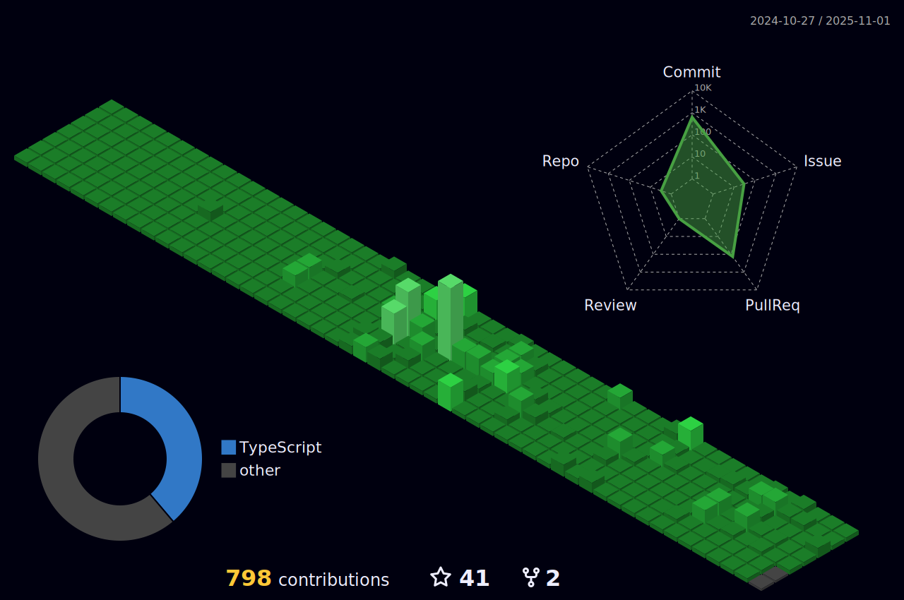

<h2 align="center">:star: Activities</h2>

    <picture>
        <source
            srcset="https://github-profile-summary-cards.vercel.app/api/cards/repos-per-language?username=herokwon&theme=tokyonight"
            media="(prefers-color-scheme: dark)">
        <source 
            srcset="https://github-profile-summary-cards.vercel.app/api/cards/repos-per-language?username=herokwon&theme=github"
            media="(prefers-color-scheme: light), (prefers-color-scheme: no-preference)">
        
    </picture>
    <picture>
        <source
            srcset="https://github-profile-summary-cards.vercel.app/api/cards/productive-time?username=herokwon&theme=tokyonight&utcOffset=9"
            media="(prefers-color-scheme: dark)">
        <source 
            srcset="https://github-profile-summary-cards.vercel.app/api/cards/productive-time?username=herokwon&theme=github&utcOffset=9"
            media="(prefers-color-scheme: light), (prefers-color-scheme: no-preference)">
        
    </picture>
    <picture>
        <source
            srcset="https://github-readme-stats.vercel.app/api?username=herokwon&show_icons=true&theme=tokyonight"
            media="(prefers-color-scheme: dark)">
        <source
            srcset="https://github-readme-stats.vercel.app/api?username=herokwon&show_icons=true&theme=github"
            media="(prefers-color-scheme: light), (prefers-color-scheme: no-preference)">
        
    </picture>

 
 

<h2 align="center">:rocket: Skills</h2>

#### Languages
  

#### Frameworks
   
 

#### Builds

#### Deployments
 

#### Services
  
 

#### Tools
   
 

