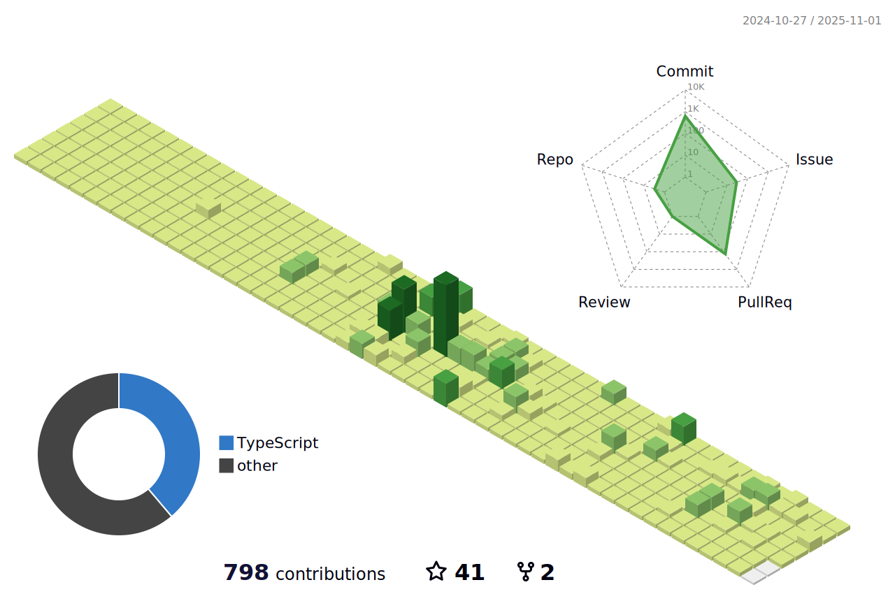

## ✒️ About Me

<h3>
  
    I'm a developer who
  
  <picture>
    <source
      srcset="https://readme-typing-svg.herokuapp.com?font=Fira+Code&weight=600&size=14&duration=3000&pause=1500&color=0087db&vCenter=true&width=240&height=24&lines=loves+humanities.;looks+beyond+the+code.;builds+with+empathy."
      media="(prefers-color-scheme: dark)" />
    <source 
      srcset="https://readme-typing-svg.herokuapp.com?font=Fira+Code&weight=600&size=14&duration=3000&pause=1500&color=00a6f4&vCenter=true&width=240&height=24&lines=loves+humanities.;looks+beyond+the+code.;builds+with+empathy."
      media="(prefers-color-scheme: light), (prefers-color-scheme: no-preference)" />
    
  </picture>
</h3>

 

## 🛠️ Skills & Tools

  
  
  
  
  
  
  

   

  
  
  
  
  
  
  
  

 

## 📊 Code Analytics

<picture>
  <source
    srcset="https://github-profile-summary-cards.vercel.app/api/cards/repos-per-language?username=herokwon&theme=tokyonight"
    media="(prefers-color-scheme: dark)" />
  <source 
    srcset="https://github-profile-summary-cards.vercel.app/api/cards/repos-per-language?username=herokwon&theme=github"
    media="(prefers-color-scheme: light), (prefers-color-scheme: no-preference)" />
  
</picture>
<picture>
  <source
    srcset="https://github-profile-summary-cards.vercel.app/api/cards/productive-time?username=herokwon&theme=tokyonight&utcOffset=9"
    media="(prefers-color-scheme: dark)" />
  <source 
    srcset="https://github-profile-summary-cards.vercel.app/api/cards/productive-time?username=herokwon&theme=github&utcOffset=9"
    media="(prefers-color-scheme: light), (prefers-color-scheme: no-preference)" />
  
</picture>
<picture>
  <source srcset="profile-stats/dark.svg" media="(prefers-color-scheme: dark)" />
  <source srcset="profile-stats/default.svg" media="(prefers-color-scheme: light), (prefers-color-scheme: no-preference)" />
  
</picture>

 

## 🚀 Activities

<picture>
  <source
    srcset="profile-3d-contrib/profile-night-green.svg"
    media="(prefers-color-scheme: dark)" />
  <source 
    srcset="profile-3d-contrib/profile-green-animate.svg"
    media="(prefers-color-scheme: light), (prefers-color-scheme: no-preference)" />
  
</picture>
